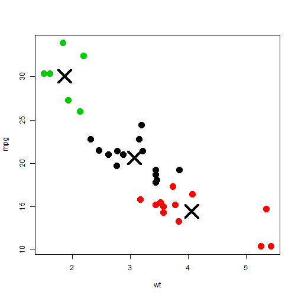

Cars fuel consumption vs aspects of design k-means clustering
========================================================
author: Guilherme Mori

Introduction
========================================================

For this project, required in the Developing Data Products from Johns Hopkins
Bloomberg School of Public Health, it used:

 - RStudio Presenter: build this presentation
 - Shiny: create the application
 - Shinyapps.io: deploys the application
 - Github: publish the codes and the presentation
 - mtcars dataset
 
**Usefull links**
 - Github repo: https://github.com/guiligan/devdataprod-015
 - Shiny app: https://guiligan.shinyapps.io/devdataprod-015

mtcars Dataset
========================================================


```r
head(mtcars)
```

```
                   mpg cyl disp  hp drat    wt  qsec vs am gear carb
Mazda RX4         21.0   6  160 110 3.90 2.620 16.46  0  1    4    4
Mazda RX4 Wag     21.0   6  160 110 3.90 2.875 17.02  0  1    4    4
Datsun 710        22.8   4  108  93 3.85 2.320 18.61  1  1    4    1
Hornet 4 Drive    21.4   6  258 110 3.08 3.215 19.44  1  0    3    1
Hornet Sportabout 18.7   8  360 175 3.15 3.440 17.02  0  0    3    2
Valiant           18.1   6  225 105 2.76 3.460 20.22  1  0    3    1
```

Application usage
========================================================

The applications should be used to create clusters against fuel consumption
and different attributes of cars designs, such as:
 
 - Weight (wt)
 - Number of cylinders (cyl)
 - Horse Power (HP)
 - Transmission (am)
 
It is intended to find similatirty between MPG and the attributes and allow
to make assumptions about new cars efficiency.

Sample output
========================================================


```r
data <- mtcars[, c("wt", "mpg")]; clusters <- kmeans(data, 3)
plot(data, col = clusters$cluster, pch = 20, cex = 3)
points(clusters$centers, pch = 4, cex = 4, lwd = 4)
```

 
